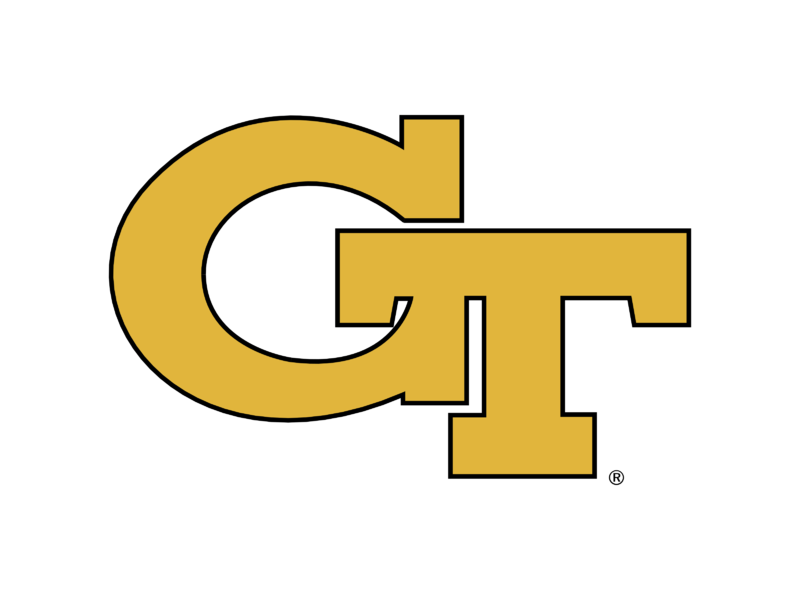

# Tab Guard 🔐
 
**Block distractions. Stay focused. Crush your goals.!**  
   
---        
     
 
  
## What is Tab Guard?
Tab Guard is a modern, beautiful Chrome extension that helps you stay focused by blocking distracting websites during your study or work sessions. With customizable themes, motivational quotes, and a timer/passcode system, Tab Guard is your digital accountability partner.
    
---            
         
## ✨ Features      
- **Focus Sessions:** Set a timer and a passcode to lock yourself into focus mode.    
- **Instant Blocking:** Distracting sites are blocked instantly—no excuses!  
- **Modern UI:** Glassmorphism, animated backgrounds, and a classic DVD logo bounce.  
- **Motivational Quotes:** Get inspired every time you're tempted to procrastinate. 
- **Customizable:** Light/dark themes, custom blocked messages, and more.   
- **Statistics:** Track your focus sessions, time, and distraction attempts.
- **Keyboard Shortcuts:** Quick toggle for power users.
  
---  
   
  
## 🚀 Installation  
1. **Clone this repo:** 
   ```bash
   git clone https://github.com/ibxbit/tab-guard.git 
   cd tab-guard 
   ```
2. **Load as Unpacked Extension:**
   - Go to `chrome://extensions/`
   - Enable "Developer mode"
   - Click "Load unpacked" and select this folder
3. **Start focusing!**

---

## 📸 Screenshots


---

## 💡 How It Was Born
> I built this for my dorm mate who said, "Hey bro, I can't control myself after I try to study, I end up on typing websites!" Tired of seeing him distracted, I created this tool to enforce focus during study time.

---

## 🛠️ Contributing 
Pull requests and suggestions are welcome! For major changes, please open an issue first to discuss what you'd like to change.

---

## 📄 License
MIT

---

## 👤 Author
[ibxbit](https://github.com/ibxbit)

---

## 🌍 Chrome Web Store
_Chrome Web Store listing coming soon!_
